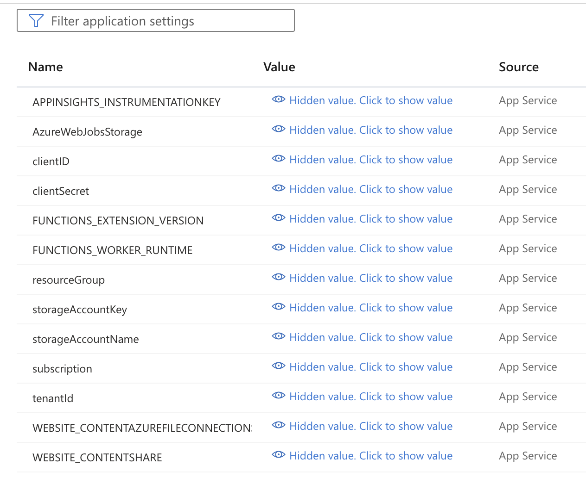
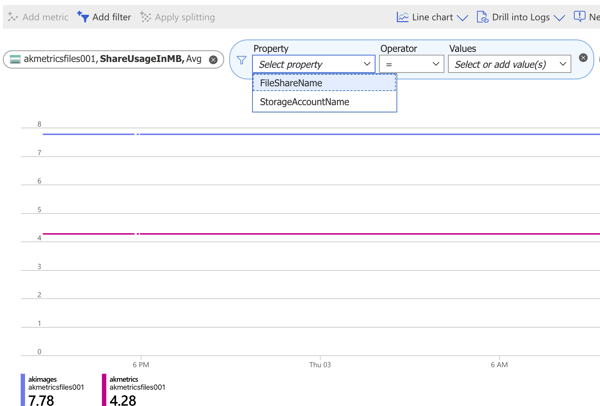

# Azure Custom Metrics Using Azure Function App and Azure Monitor

Author: Abdelaziz KHAJOUR 
(Azure Cloud Solution Architect)

## Reference
This app is an implementation example of Microsoft Azure custom metrics
https://learn.microsoft.com/en-us/azure/azure-monitor/essentials/metrics-custom-overview

## How to test this function

- Deploy you function app to Azure
- Create an System managed identity for cloud storage with the adequate role 
- Register the function app with Monitoring Metrics Publisher role in your subscription
- Change the configuration parameters of your function app

- start the function app and check the result in Azure monitor Metrics section

---